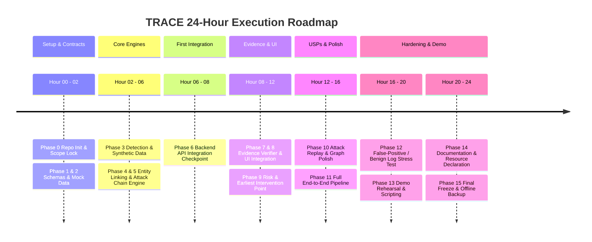

# TRACE: 24-Hour Hackathon Execution Plan
**System:** TRACE (Threat Reconstruction and Attack Chain Evidence)  
**Hackathon:** Karunya Institute of Technology and Sciences — Internal Qualifier  
**Problem Statement:** HNX26PSI03: AI-Powered Cyber Threat Intelligence  
**Duration:** Exactly 24 Hours  
**Team Composition:**
- **DEV-1:** AI / ML + Detection + Dataset Engineering
- **DEV-2:** Backend + Graph Analytics + Attack Chain Engine + API
- **FE:** Frontend Developer (UI/UX, Graph Visualization, Interactive Replay)

---

## 1. Executive Strategy & Team Operating Rules

### 1.1 Core Strategic Principle
We are building a **focused, highly demonstrable vertical slice** that satisfies 100% of the judging criteria for problem statement HNX26PSI03. We are **not** building a commercial SIEM or an alert spammer. 

Our guiding product principle:
> **RAW LOGS → NORMALIZATION → ENTITY LINKING → DETECTION → TEMPORAL ATTACK CHAIN RECONSTRUCTION → EVIDENCE VERIFICATION → RISK/INTERVENTION POINT → INTERACTIVE TIMELINE & GRAPH.**

### 1.2 Team Roles & Ownership Matrix
To guarantee zero merge conflicts and continuous productivity over 24 hours, file and directory ownership is strictly partitioned:

| Module / Directory | Primary Owner | Secondary / Reviewer | Content & Deliverables |
|---|---|---|---|
| `data/` | **DEV-1** | DEV-2 | Log generators, raw JSON datasets (benign + attack), normalization loaders |
| `detection/` | **DEV-1** | DEV-2 | Heuristic detectors, baseline anomaly scoring, event flaggers |
| `shared/schemas/` | **DEV-1 & DEV-2 (Co-owned)** | FE | Pydantic data schemas, API contracts, JSON schema specs |
| `engine/` | **DEV-2** | DEV-1 | Entity linker, NetworkX graph builder, temporal attack-chain correlator, evidence verifier, risk calculator |
| `backend/` | **DEV-2** | FE | FastAPI application, route controllers, session/job runner, CORS config |
| `frontend/` | **FE** | DEV-2 | React/Vite dashboard, timeline, Cytoscape/ReactFlow graph, evidence drawer, replay controller |
| `tests/` | **DEV-1 & DEV-2** | DEV-1 | Unit tests for detection, graph algorithms, schema validity, false-positive verification |
| `docs/` & `README.md` | **All (Lead: DEV-2)** | DEV-1 & FE | Setup instructions, architecture diagrams, resource declarations, demo script |

### 1.3 Git Workflow & Branching Discipline
- **`main` Branch:** Protected. Always deployable and passing tests. No direct unverified commits.
- **Feature Branches:**
  - `dev1/data-detection` (DEV-1)
  - `dev2/backend-engine` (DEV-2)
  - `fe/dashboard-ui` (FE)
- **Checkpoints & Handoffs:** Code is merged into `main` only at scheduled synchronization checkpoints after verifying schema compatibility.
- **Commit Format:** `[DEV-1|DEV-2|FE] [PHASE-X] <Imperative verb> <Description>` (e.g., `[DEV-1] [PHASE-1] Define NormalizedEvent Pydantic schema`).

---

## 2. Chronological 24-Hour Execution Schedule

---

### Hour 0–1 | Phase 0: Repository, Environment & Scope Lock
**Goal:** Initialize shared codebase, configure linters/formatters, freeze technology stack, establish git branches.

#### DEV-1 (AI/Detection Lead)
- Set up Python virtual environment (`requirements-dev.txt` with `pydantic`, `scikit-learn`, `pytest`).
- Establish `data/` and `detection/` folder scaffolds.
- Draft the initial list of 5 attack stages:
  1. `SUSPICIOUS_LOGIN`
  2. `UNUSUAL_SESSION_DEVICE`
  3. `PRIVILEGE_ESCALATION`
  4. `SENSITIVE_RESOURCE_ACCESS`
  5. `OUTBOUND_EXFILTRATION`
- **Output:** `detection/` skeleton, stage definitions draft.

#### DEV-2 (Backend/Graph Lead)
- Initialize Git repository, `.gitignore`, and main branch configuration.
- Set up backend scaffold (`backend/main.py`, `backend/routes/`, `engine/`).
- Install FastAPI, Uvicorn, NetworkX.
- Establish `shared/schemas/` directory.
- **Output:** Runnable FastAPI skeleton returning `{"status": "ok"}` on `GET /api/health`.

#### FE (Frontend Lead)
- Initialize React project using Vite (`frontend/`) with Tailwind CSS and Lucide icons.
- Install graph rendering library (`cytoscape` + `cytoscape-dagre` or `@xyflow/react`).
- Configure local dev server proxy to `http://localhost:8000`.
- **Output:** Running frontend shell on `http://localhost:5173` with placeholder dashboard cards.

#### Handoff & Dependency Flow
- **DEV-2** pushes initial repo structure to `main`.
- **DEV-1** and **FE** pull from `main` and branch out into `dev1/data-detection` and `fe/dashboard-ui`.
- **GIT CHECKPOINT 0:** Verified clean clone, local backend starts on `:8000`, frontend starts on `:5173`.

---

### Hour 1–2 | Phase 1 & Phase 2: Schema Freezing & Contract Locking
**Goal:** Define the single source of truth for all data structures (`NormalizedEvent`, `AttackStage`, `AttackGraph`, `AnalysisResult`). No team member can proceed with dependent logic until these schemas are frozen.

#### DEV-1
- Author `shared/schemas/events.py`:
  - `NormalizedEvent` model: `event_id`, `timestamp`, `event_type`, `user`, `device`, `source_ip`, `destination_ip`, `application`, `resource`, `action`, `status`, `metadata`, `raw_log`.
- Author sample JSON test fixtures:
  - `data/samples/sample_benign_event.json`
  - `data/samples/sample_attack_event.json`
- Commit to `dev1/data-detection` and create PR to `main`.

#### DEV-2
- Review DEV-1's event schema and author `shared/schemas/responses.py`:
  - `EvidenceReference`: `event_id`, `timestamp`, `field_provenance`, `raw_snippet`.
  - `AttackStageDTO`: `stage_id`, `stage_name`, `timestamp_start`, `timestamp_end`, `evidence_event_ids`, `entities_involved`, `risk_score`, `confidence`.
  - `AttackGraphDTO`: `nodes` (`id`, `label`, `type`, `is_compromised`), `edges` (`source`, `target`, `relation`, `evidence_event_id`).
  - `InterventionRecommendationDTO`: `recommended_action`, `target_entity`, `earliest_stage_id`, `rationale`.
  - `AnalysisResponse`: `overall_risk`, `confidence`, `stages`, `timeline`, `graph`, `intervention`, `unlinked_anomalies_count`.
- Merge DEV-1 PR and merge `shared/schemas/` into `main`.

#### FE
- Convert `shared/schemas/` into TypeScript definitions or structured JavaScript mock state (`frontend/src/types/schema.ts`).
- Create `frontend/src/mock/mockAnalysisResponse.json` matching `AnalysisResponse`.
- Wire frontend components to mock data so UI development is decoupled from backend availability.

#### Handoff & Dependency Flow
- **DEV-1 + DEV-2** PUSH and MERGE `shared/schemas/` into `main`.
- **FE** PULLS `main` and validates `mockAnalysisResponse.json` against the schema.
- **GIT CHECKPOINT 1:** Schemas frozen. Contracts locked. Neither backend nor frontend will deviate from field names.

---

### Hour 2–4 | Phase 3 & Phase 4: Synthetic Dataset Engine & Entity Graph Linker
**Goal:** DEV-1 generates realistic security logs (benign + multi-stage attack). DEV-2 constructs graph nodes and edges. FE builds interactive dashboard layout.

#### DEV-1
- Develop `data/generator.py`:
  - Generates 150 benign background events (regular logins, everyday web traffic, routine cron jobs, standard file access across 10 clean users).
  - Generates 1 coherent 5-stage attack scenario involving compromised user `j.doe`, rogue IP `198.51.100.42`, target server `srv-finance-01`, and exfiltration to `203.0.113.88`.
  - Injects realistic noise (e.g., 2 isolated failed logins by random users that do *not* form an attack chain).
- Save generated datasets:
  - `data/fixtures/benign_traffic.json`
  - `data/fixtures/multi_stage_attack.json`
  - `data/fixtures/mixed_stream.json`
- **Output:** Reproducible dataset generator and verified JSON files.

#### DEV-2
- Develop `engine/entity_linker.py`:
  - Parses `NormalizedEvent` objects.
  - Extracts canonical entities: `User`, `Device`, `IP`, `Application`, `File`, `Destination`.
  - Deduplicates entity identifiers (e.g., lowercase usernames, canonical IP strings).
- Develop `engine/graph_builder.py`:
  - Uses NetworkX (`DiGraph`).
  - Creates nodes with metadata: `{type: 'USER', label: 'j.doe', compromised: false}`.
  - Creates directed edges representing observed log interactions: `USER -> LOGGED_IN_FROM -> IP`, `DEVICE -> ACCESSED -> FILE`.
  - **Crucial Rule:** Every edge stores an attribute `evidence_event_ids: [event.event_id]`.
- Unit test graph construction on sample events.
- **Output:** Unit-tested entity graph builder that rejects ghost edges.

#### FE
- Build base UI components in `frontend/src/components/`:
  - `ThreatHeader.jsx`: Risk gauge (Low, Medium, High, Critical), attack status indicator, affected user/device counters.
  - `TimelineView.jsx`: Chronological event card track with timestamp badges and stage tags.
  - `GraphCanvas.jsx`: Canvas initialization using Cytoscape/ReactFlow, node styling by entity type (User=blue, Device=gray, IP=orange, File=purple).
- Verify mock data renders cleanly in the layout.

#### Handoff & Dependency Flow
- **DEV-1** PUSHES `data/fixtures/` and `data/generator.py` to `dev1/data-detection`.
- **DEV-2** PULLS `data/fixtures/` to test `engine/entity_linker.py` against full data streams.
- **FE** continues styling layout components using the locked mock JSON.
- **GIT CHECKPOINT 2:** Data fixtures exist; entity linking creates directed graphs from realistic data.

---

### Hour 4–6 | Phase 4 & Phase 5: Detection Engine & Temporal Attack Chain Correlator
**Goal:** DEV-1 implements deterministic & anomaly detection. DEV-2 builds the attack-chain reasoning engine. FE adds UI interactivity.

#### DEV-1
- Implement `detection/detector.py`:
  - Rule & Statistical Detectors:
    - `detect_unusual_login`: Flags off-hours login or novel IP for user.
    - `detect_device_drift`: Flags session identifier seen on an unfamiliar device.
    - `detect_privilege_escalation`: Flags unexpected `sudo` / token elevation / unauthorized child process.
    - `detect_sensitive_access`: Flags read access to high-value file directories (`/confidential/finance/`).
    - `detect_exfiltration`: Flags outbound data volume anomalies or egress to unclassified external IPs.
  - Each detector outputs: `is_suspicious: bool`, `anomaly_score: float (0.0-1.0)`, `reason: str`.
- Implement `detection/filter.py`: Suppresses isolated benign events (e.g., single mistyped password does not trigger alerts).
- Write `tests/test_detection.py` to assert clean logs produce zero attack triggers.
- **Output:** Detection pipeline that annotates events with anomaly metadata.

#### DEV-2
- Implement `engine/chain_correlator.py`:
  - **Temporal Ordering:** Sorts suspicious events chronologically.
  - **Entity Continuity:** Links event $E_n$ to $E_{n+1}$ if they share at least one entity (same user, same device, or same session IP) within a sliding time window $\Delta t \le 60\text{ mins}$.
  - **Stage Grouping:** Maps correlated events to kill-chain stages (Initial Access → Execution → Privilege Escalation → Collection → Exfiltration).
  - **False Alarm Elimination:** If correlated cluster contains fewer than 3 stages or lacks critical entity binding, it is categorized as `UNLINKED_ANOMALIES` rather than an active `ATTACK_CHAIN`.
- Output verified `AttackChain` object.
- **Output:** Temporal correlation logic tested on `multi_stage_attack.json`.

#### FE
- Enhance `frontend/src/components/`:
  - `EvidenceDrawer.jsx`: Collapsible side panel that opens when a timeline event or graph node is clicked, showing raw JSON log, timestamp, and field provenance.
  - `StageDetailsModal.jsx`: Shows stage description, supporting event count, and entity summary.
- Add zoom, pan, and node click handlers in `GraphCanvas.jsx`.

#### Handoff & Dependency Flow
- **DEV-1** PUSHES `detection/detector.py` to `dev1/data-detection`.
- **DEV-2** PULLS detector code, imports `run_detection()` into backend pipeline, and feeds output directly into `chain_correlator.py`.
- **GIT CHECKPOINT 3:** Suspicious events detected and correlated into an ordered multi-stage chain.

---

### Hour 6–8 | Phase 6: First Backend Integration Checkpoint
**Goal:** Assemble the complete backend pipeline (`Log Input → Detection → Graph → Attack Chain`) and expose REST API endpoints. FE replaces mock data with live API calls.

#### DEV-1
- Verify and fine-tune detection thresholds on edge cases.
- Create automated test: `tests/test_end_to_end_detection.py` ensuring that `data/fixtures/benign_traffic.json` outputs 0 attack chains.
- Assist DEV-2 with integration debugging.

#### DEV-2
- Wire full pipeline into `backend/routes/investigation.py`:
  - `POST /api/analyze`: Accepts raw logs payload or fixture selector (`scenario: "attack" | "benign"`), executes normalizer → detection → linker → correlation, returns `AnalysisResponse`.
  - `GET /api/scenarios`: Returns list of pre-seeded demonstration scenarios.
- Enable CORS for `localhost:5173`.
- Write smoke test in `tests/test_api.py`.
- Merge `dev2/backend-engine` into `main`.

#### FE
- Create `frontend/src/services/api.js` using `fetch` / `axios`.
- Add scenario selector dropdown in header: `[Clean/Benign Baseline]` vs `[Multi-Stage Attack Scenario]`.
- Wire `POST /api/analyze` response directly to dashboard state.
- Add Loading Spinner and Error Boundary components.

#### Handoff & Dependency Flow
- **DEV-2** merges working backend to `main`.
- **DEV-1** and **FE** pull updated `main`.
- **FE** points client to live `http://localhost:8000/api/analyze` and confirms graph and timeline populate dynamically.
- **GIT CHECKPOINT 4 (CRITICAL):** First end-to-end milestone achieved. Live frontend displays live backend analysis of logs.

---

### Hour 8–10 | Phase 7 & Phase 8: Evidence Verification Engine & Dynamic Graph Rendering
**Goal:** Enforce Problem Statement Rule: **"Every attack stage must have proof."** Backend adds explicit cryptographic/hash-bound evidence verification. FE builds deep-inspection UI.

#### DEV-1
- Implement `engine/evidence_verifier.py`:
  - Computes `evidence_integrity_hash` for each stage based on the raw log payloads of its supporting events.
  - Validates that every stage has $\ge 1$ supporting event with raw log present.
  - Rejects or marks `UNSUPPORTED` any attack stage that lacks concrete raw event IDs.
- Write unit tests verifying that removing an event ID invalidates the stage's evidence score.
- **Output:** Strict evidence validation module.

#### DEV-2
- Integrate `evidence_verifier.py` into `AnalysisResponse` generation.
- Enrich graph serialization:
  - Attach `evidence_event_ids` to each graph edge.
  - Compute graph node status (`is_compromised: true` if node belongs to confirmed attack chain).
  - Include summary badges: `supporting_events_count`, `evidence_summary` in each stage payload.
- Update API response and test on live server.

#### FE
- Implement dynamic node & edge styling:
  - Compromised nodes: Red pulsing border with warning icon.
  - Attack edges: Red solid arrow with stage number label (e.g., `(1) Login`, `(4) File Access`).
  - Normal/context nodes: Neutral slate gray.
- Implement Evidence Drill-Down Drawer:
  - Clicking any graph edge or timeline card highlights the exact supporting raw log lines.
  - JSON viewer with syntax highlighting and copy-to-clipboard functionality.

#### Handoff & Dependency Flow
- **DEV-1** commits `evidence_verifier.py` to `dev1/data-detection`.
- **DEV-2** incorporates it into the API pipeline and pushes to `main`.
- **FE** pulls `main` and verifies clicking a graph edge brings up the exact raw log entry.
- **GIT CHECKPOINT 5:** 100% evidence traceability active from graph/timeline down to raw log strings.

---

### Hour 10–12 | Phase 9: Risk Scoring & Earliest Intervention Point Algorithm
**Goal:** Implement mathematical risk scoring and graph-based Earliest Intervention Point determination.

#### DEV-1
- Develop `engine/risk_scorer.py`:
  - **Deterministic Formula:**
    $$\text{Stage Risk} = \text{Severity}(\text{Stage}) \times \text{Confidence}(\text{Evidence Density}) \times \text{Asset Criticality}$$
    $$\text{Total Attack Risk} = \min\left(100, \, \sum \text{Stage Risk} \times \text{Chain Length Multiplier}\right)$$
  - No random numbers. Every score is explainable with a mathematical breakdown.
- Develop `engine/intervention_finder.py`:
  - Analyzes the chronological chain.
  - Identifies the transition edge from Reconnaissance/Access to Execution/Impact (the "Pivot Point").
  - Evaluates where the attack could have been severed with minimal collateral damage (e.g., revoking user session after Step 2 before Step 4 sensitive file read).
  - Generates concrete, context-specific remediation action (`REVOKE_SESSION`, `ISOLATE_HOST`, `BLOCK_IP`, `KILL_PID`).

#### DEV-2
- Wire `risk_scorer.py` and `intervention_finder.py` into `backend/routes/investigation.py`.
- Add endpoint `POST /api/simulate-intervention`:
  - Simulates the graph state *if* the recommended intervention had been taken at Stage 2 (proves stages 3, 4, 5 are neutralized).
- Test endpoint and verify response payload structure.

#### FE
- Build `InterventionCard.jsx`:
  - Prominent banner: **"Recommended Earliest Intervention Point: Stage 2 (Session Drift)"**.
  - Displays:
    - *Why this point:* "Halts kill chain before exfiltration or sensitive directory access."
    - *Prescribed Action:* "Revoke Session ID `sess-8821` & Isolate Host `srv-finance-01`."
    - *Calculated Impact:* "Prevents 3 downstream attack stages, saving sensitive financial assets."
  - "Simulate Intervention" toggle button to show severed attack graph.

#### Handoff & Dependency Flow
- **DEV-1** and **DEV-2** integrate risk & intervention engines into backend.
- **FE** binds `InterventionCard` to API payload.
- **GIT CHECKPOINT 6:** Explainable risk scoring and Earliest Intervention Point live.

---

### Hour 12–14 | Phase 10: USP Implementation (Attack Replay & Interactive Story)
**Goal:** Implement our primary differentiators: **Attack Replay Controller**, **Evidence-First Graph**, and **Explainable Confidence Breakdown**.

#### DEV-1
- Implement Analyst Story Generator in `engine/story_generator.py`:
  - Produces structured, chronological narrative summary of the incident (deterministic template engine, zero LLM hallucination risk).
  - Format:
    - `09:14:02` — *Initial Access:* Unusual authentication for `j.doe` from unfamiliar external IP `198.51.100.42`.
    - `09:16:45` — *Session Migration:* Session resumed from unknown device fingerprint `DEV-MAC-UNKNOWN`.
    - `09:19:10` — *Privilege Escalation:* Unauthorized execution of elevated command `sudo -u root` spawned by PID 4012.
    - `09:23:30` — *Collection:* 14 sensitive records accessed in `/confidential/finance/q3_forecast.xlsx`.
    - `09:27:15` — *Exfiltration:* Outbound HTTPS burst of 45MB to unlisted external destination `203.0.113.88`.

#### DEV-2
- Expose replay timeline events via API:
  - Formats events with incremental step indices (`step: 1` through `step: 5`).
  - Supports incremental graph state generation so the frontend can query or step through the attack timeline.

#### FE
- Build `AttackReplayControls.jsx`:
  - Media player interface: `[Play]`, `[Pause]`, `[Step Back]`, `[Step Forward]`, `[Reset]`, and a scrubber bar.
  - When playing, timeline highlights step-by-step with 1.5s intervals.
  - Graph nodes and edges dynamically animate into existence in timestamp order.
  - Evaluator sees the attack unfold from clean baseline to full compromise.

#### Handoff & Dependency Flow
- **DEV-1** PUSHES narrative generator.
- **DEV-2** exposes narrative in API response.
- **FE** implements play/pause animation loop.
- **GIT CHECKPOINT 7:** Attack Replay and Narrative Story functional.

---

### Hour 14–16 | Phase 11: End-to-End System Integration & Rigorous Testing
**Goal:** Perform full multi-person integration pass. Verify all systems communicate smoothly under realistic conditions.

#### DEV-1, DEV-2, FE Collaborative Sprint
- **Test Case 1: Benign Log Feed**
  - Ingest `benign_traffic.json` (150 events).
  - **Expected:** Overall Risk = `LOW (<15)`, Attack Chains = `0`, Evaluator sees green status dashboard, zero false alarm spam.
- **Test Case 2: Multi-Stage Attack Feed**
  - Ingest `multi_stage_attack.json` (5 attack events + 50 benign noise events).
  - **Expected:** Overall Risk = `CRITICAL (92)`, Attack Chains = `1` (5 stages linked), Earliest Intervention = Stage 2, all 5 stages have verifiable raw log evidence.
- **Test Case 3: Partial / Broken Chain**
  - Ingest 2 isolated anomalies (e.g., 1 failed login and 1 unrelated error log).
  - **Expected:** Attack Chains = `0`, flagged as low-priority isolated anomalies without triggering an attack alarm.
- Fix UI rendering bugs, graph layout overlaps, and API response latency.

#### Handoff & Dependency Flow
- All bug fixes committed directly to `main` with thorough code review.
- **GIT CHECKPOINT 8:** All 3 test cases pass with zero failures.

---

### Hour 16–18 | Phase 12: False-Positive & Benign Log Stress Testing
**Goal:** Prove compliance with the critical problem statement requirement: **"False positives matter. Does it stay quiet on benign logs?"**

#### DEV-1
- Generate `data/fixtures/stress_benign_500.json` (500 clean enterprise log events with standard administrative actions, password resets, VPN logins, regular file shares).
- Run benchmark script `tests/benchmark_false_positives.py`:
  - Count false positive attack chains detected: **Target = 0**.
  - Measure event processing throughput.
- Document false-positive control logic:
  - Requirement of cross-entity correlation before chain declaration.
  - Requirement of sequential stage advancement (single stage cannot trigger an incident).

#### DEV-2
- Implement "Noise Suppression Rate" metric in backend telemetry:
  - Telemetry endpoint `GET /api/telemetry` reporting:
    - Total events ingested: `500`
    - Filtered benign noise: `498`
    - Correlated attack chains: `0`
    - False positive rate: `0.0%`

#### FE
- Add a dedicated **"False Positive Benchmark"** tab or view in the UI:
  - Allows judges to click **"Run Benign Stress Test (500 logs)"**.
  - Shows real-time progress bar.
  - Proves the system remains calm, green, and completely quiet when no attack exists.

#### Handoff & Dependency Flow
- **DEV-1** validates 0 false positives on stress dataset.
- **FE** exposes the stress test trigger in the UI for live evaluator inspection.
- **GIT CHECKPOINT 9:** False-positive resistance provably demonstrated and benchmarked.

---

### Hour 18–20 | Phase 13: Live Demo Scripting & Rehearsal
**Goal:** Prepare a flawless 3-minute evaluator presentation.

#### DEV-1
- Review detection explanations and refine evidence summaries for maximum clarity and technical precision.
- Prepare defense against judge questions on ML vs heuristic trade-offs and anomaly scoring math.

#### DEV-2
- Prepare live terminal demonstrations (e.g., running curl requests or test runners) as a technical backup.
- Verify backend runs reliably offline without external internet access.

#### FE
- Polish UI styles, font readability, contrast, and animations.
- Ensure the live demo sequence runs in under 3 clicks:
  1. Click *Load Benign Stream* → Screen stays green.
  2. Click *Load Active Attack Stream* → Screen updates to show 5-stage reconstruction.
  3. Click *Attack Replay* → Interactive story plays step-by-step.
  4. Click *Earliest Intervention Point* → Highlights recommended containment action.

#### Handoff & Dependency Flow
- The full team performs **3 timed dry-run demo rehearsals**.
- Identify and eliminate any clunky UI transitions or confusing technical jargon.
- **GIT CHECKPOINT 10:** Demo flow finalized and verified.

---

### Hour 20–22 | Phase 14: Documentation, README & Resource Declaration
**Goal:** Create comprehensive documentation compliant with hackathon submission guidelines.

#### DEV-1
- Write Section 4 of `README.md`: Model & Detection Methodology, Anomaly Scoring Formulation, False-Positive Control Logic.
- Document dataset generation schema in `data/README.md`.

#### DEV-2
- Author main `README.md`:
  - Quickstart guide (Run backend in 1 command, run frontend in 1 command).
  - Complete architecture diagram (ASCII/Mermaid).
  - API endpoint specifications.
  - Official Resource Declarations (external libraries, pre-trained weights, simulated data).
  - Scope Note (clearly stating what is MVP vs stretch goals).

#### FE
- Take UI screenshots and generate animated GIFs or SVG diagrams for the README.
- Verify UI renders properly across standard display resolutions (1080p laptop screen).

#### Handoff & Dependency Flow
- Review and finalize documentation together.
- Merge all documentation into `main`.
- **GIT CHECKPOINT 11:** Documentation and resource declarations complete.

---

### Hour 22–23 | Phase 15: Code Freeze, Offline Backup & Dry Runs
**Goal:** Strict code freeze. No new features. Validate offline execution.

#### Entire Team
- **CODE FREEZE:** Zero code modifications permitted except critical crash fixes.
- Test cold reboot:
  - Restart machine/terminals.
  - Run setup commands strictly from the `README.md`.
  - Confirm backend and frontend boot cleanly within 60 seconds.
- Create an offline zip backup of the entire working repository and fixture files.
- Rehearse the 3-minute pitch 2 additional times.
- **GIT CHECKPOINT 12 (FINAL):** Tag release `v1.0.0-hackathon-final`.

---

### Hour 23–24 | Buffer & Final Submission Check
**Goal:** Verify submission portal links, repository visibility, video/demo readiness, and relax before presentation.

---

## 3. Integration Order & Handshake Matrix

| Step | Artifact / Contract | Producer | Consumer | Trigger / Condition | Verification Gate |
|---|---|---|---|---|---|
| **1** | `shared/schemas/events.py` | DEV-1 | DEV-2, FE | Hour 1: Schema draft complete | `pytest tests/test_schemas.py` passes |
| **2** | `shared/schemas/responses.py` | DEV-2 | FE | Hour 2: Response DTOs locked | Pydantic model parses mock response |
| **3** | `data/fixtures/` | DEV-1 | DEV-2 | Hour 3: Synthetic log generation | NetworkX ingests 150 events without KeyError |
| **4** | `detection/detector.py` | DEV-1 | DEV-2 | Hour 5: Anomaly detectors unit-tested | Benign events output `anomaly_score < 0.3` |
| **5** | `engine/chain_correlator.py` | DEV-2 | Backend API | Hour 6: Graph correlation logic complete | 5-stage attack linked in chronological order |
| **6** | `POST /api/analyze` | DEV-2 | FE | Hour 7: REST API exposed | `curl -X POST /api/analyze` returns 200 OK |
| **7** | `engine/evidence_verifier.py` | DEV-1 | DEV-2 | Hour 9: Hash verification logic written | Stage without events raises ValidationError |
| **8** | `engine/intervention_finder.py` | DEV-1 | DEV-2, FE | Hour 11: Pivot algorithm verified | Identifies Stage 2 as optimal cutoff point |
| **9** | `AttackReplayControls.jsx` | FE | Live Demo | Hour 14: Step-by-step playback component | Canvas highlights nodes sequentially |
| **10** | `tests/benchmark_false_positives.py` | DEV-1, DEV-2 | Evaluator | Hour 17: 500-event stress test run | 0 false alarm chains produced |

---

## 4. Fallback & Risk Mitigation Strategy

In a 24-hour sprint, unforeseen blockers must not derail the final demo. We adhere to strict fallback paths:

| Risk / Failure Mode | Threshold / Trigger | Immediate Fallback Action | Preserved Judging Requirement |
|---|---|---|---|
| **Anomaly ML model is noisy or unstable** | Fails to suppress benign logs by Hour 5 | Fall back to **deterministic rule-based heuristics** with weighted statistical thresholds. Discard complex ML. | Correct event correlation and 0 false alarms. |
| **Interactive Graph library issues** | Canvas fails to render or layout crashes by Hour 6 | Switch to a **structured SVG node-link visualizer** or interactive CSS grid tree. Avoid canvas debugging. | Visual entity relationships and node inspection. |
| **Evidence verification performance lag** | Graph traversal takes $>2\text{ seconds}$ on 500 events | Pre-index entities into an in-memory hash table during ingestion (`dict[entity_id, list[event_id]]`). | Real-time response and accurate timeline. |
| **LLM integration / API timeout** | Any third-party LLM API fails or adds latency | Use **deterministic template-based narrative generation** (`engine/story_generator.py`). Zero third-party API dependencies. | Clear explanation of attack story and rationale. |
| **Complex frontend state bugs** | UI fails to sync replay state by Hour 15 | Fall back to a static tabbed view showing each stage with a "Next Stage" button instead of continuous playback. | Step-by-step story comprehension. |
| **Scope creep pressure** | Urge to add cloud logging, Kafka, or auth | **Strict veto.** Reject any feature not required by HNX26PSI03. | Vertical slice excellence over incomplete breadth. |

---

## 5. Definition of Done (DoD)

The TRACE project is officially complete and submission-ready **only** when all of the following verifiable conditions are met:

- [ ] **Log Ingestion:** Raw JSON security logs can be ingested via API payload or fixture loader.
- [ ] **Event Normalization:** Heterogeneous raw log fields are mapped cleanly to `NormalizedEvent`.
- [ ] **Multi-Entity Linking:** Users, devices, IP addresses, applications, and files are linked into a queryable graph.
- [ ] **Temporal Reconstruction:** The 5-stage attack chain is reconstructed strictly in chronological order.
- [ ] **100% Evidence Traceability:** Every attack stage links to $\ge 1$ raw event ID, and clicking it displays the exact log text.
- [ ] **False-Positive Suppression:** Ingesting 500 benign logs produces **0** attack alerts and maintains a green dashboard.
- [ ] **Risk Score Generation:** Overall risk and stage-level risks are calculated deterministically by implemented code.
- [ ] **Earliest Intervention Point:** The system identifies Stage 2 as the optimal intervention point and explains why.
- [ ] **Actionable Recommendation:** Clear, practical containment steps (e.g., revoke session, block IP) are generated.
- [ ] **Dual-View UI:** Both the chronological timeline and the entity relationship graph render interactively.
- [ ] **Attack Replay:** Evaluator can step through the attack timeline from inception to impact.
- [ ] **Zero Internet Requirement:** The system boots and runs 100% locally on localhost without external API dependencies.
- [ ] **README Execution:** A reviewer can clone the repository, run two commands, and experience the working demo.
