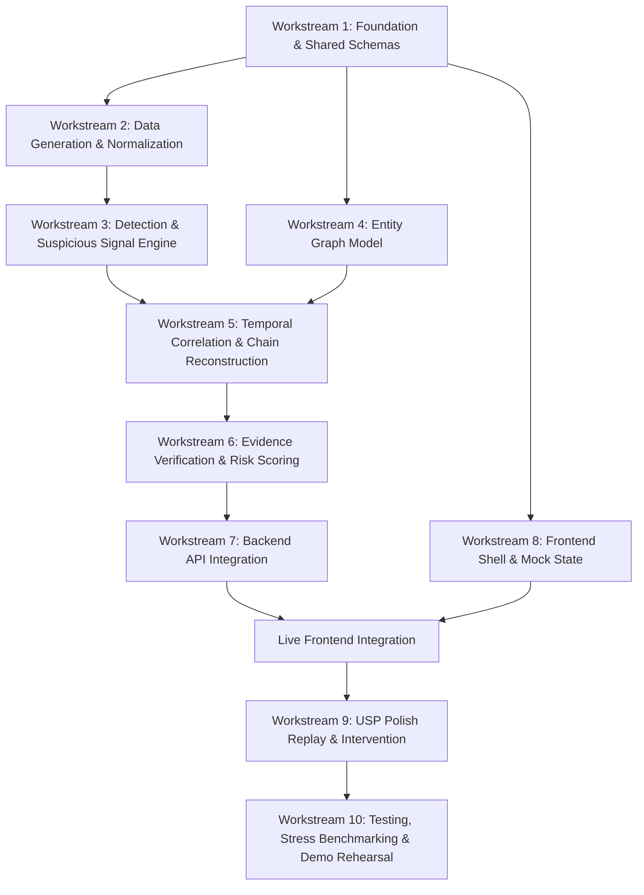

# TRACE: Team Execution Plan (Living Document)
**System:** TRACE (Threat Reconstruction and Attack Chain Evidence)  
**Hackathon:** Karunya Institute of Technology and Sciences — Internal Qualifier (24-Hour Build)  
**Problem Statement:** HNX26PSI03 — AI-Powered Cyber Threat Intelligence  
**Document Status:** Living Plan — updateable as implementation details, findings, or priorities evolve.

---

## 1. Execution Philosophy & Strategic Direction

This document is **not** an inflexible hour-by-hour schedule. In a high-speed 24-hour hackathon, implementation details shift, bugs appear, certain ideas prove harder than anticipated, and smarter shortcuts emerge. 

Instead of prescribing rigid minute-level deadlines, this plan defines:
1. **Clear Direction:** A focused vertical slice addressing 100% of the judging criteria of HNX26PSI03.
2. **Strict Ownership:** Who drives what without blocking others or stepping on files.
3. **Explicit Dependencies:** Who produces what artifact, who pulls it, and what happens next.
4. **Milestone Checkpoints:** Verifiable states of completion (Checkpoints A through I) rather than arbitrary clock times.
5. **Priority Triage (P0 to P3):** Clear knowledge of what to build first and what to drop immediately if time runs short.
6. **Agile Fallbacks:** Practical alternatives to preserve the core problem-statement requirements at all times.

---

## 2. Team Roles & Ownership Areas

The team operates across three core domains. These represent primary ownership, not isolated silos:

```
┌─────────────────────────────────┐   ┌─────────────────────────────────┐   ┌─────────────────────────────────┐
│     DEV-1: AI/ML & Detection    │   │  DEV-2: Backend & Graph Engine  │   │     FE: Frontend & UI/UX        │
├─────────────────────────────────┤   ├─────────────────────────────────┤   ├─────────────────────────────────┤
│ • Dataset preparation & samples │   │ • Backend architecture (FastAPI)│   │ • Dashboard layout & styling    │
│ • Log normalization logic       │   │ • Entity linking & deduplication│   │ • Attack timeline component     │
│ • Suspicious event detection    │   │ • Directed attack graph model   │   │ • Interactive graph canvas      │
│ • Anomaly scoring & heuristics  │   │ • Temporal chain correlation    │   │ • Evidence drawer & log viewer  │
│ • False-positive control        │   │ • Stage identification engine   │   │ • Risk & intervention UI cards  │
│ • Detection unit & stress tests │   │ • API contracts & endpoints     │   │ • Attack replay controls        │
└─────────────────────────────────┘   └─────────────────────────────────┘   └─────────────────────────────────┘
                 │                                     │                                     │
                 └───────────────► [SHARED CONTRACTS: schemas & fixtures] ◄───────────────────┘
```

### DEV-1: AI/ML + Detection Lead
- **Primary Ownership:** `data/`, `detection/`, sample log generators, detection rule/anomaly logic, detection evaluation, false-positive verification tests.
- **Key Responsibilities:**
  - Create realistic security logs (both multi-stage attack and benign background traffic).
  - Define normalization parsing rules.
  - Build anomaly/heuristic detection algorithms.
  - Implement noise suppression so benign events remain quiet.
  - Validate detection accuracy on test data.
- **Shared Touchpoints:** Reviews event schemas with DEV-2; collaborates with DEV-2 on correlation inputs.

### DEV-2: Backend + Graph Analytics + Attack Chain Lead
- **Primary Ownership:** `backend/`, `engine/`, `shared/schemas/`, NetworkX graph construction, temporal correlation, evidence binding, risk calculation, API endpoints.
- **Key Responsibilities:**
  - Establish backend server and shared data schemas.
  - Build entity resolution (connecting users, devices, IPs, applications, processes, files).
  - Implement temporal attack-chain correlator.
  - Ensure every attack stage links directly to raw event proof.
  - Expose stable REST API endpoints for frontend consumption.
- **Shared Touchpoints:** Locks API contract with FE; integrates detection outputs from DEV-1.

### FE: Frontend / UI / Visualization Lead
- **Primary Ownership:** `frontend/` (React/Vite), UI component structure, timeline visualization, interactive graph canvas, evidence inspection modal/drawer, attack replay controls.
- **Key Responsibilities:**
  - Build the visual cyber threat dashboard.
  - Render chronological attack stages and timeline progression.
  - Render entity relationship graph (Cytoscape / ReactFlow / SVG).
  - Provide interactive drill-down so evaluators can inspect raw evidence.
  - Build replay playback controls (Play, Pause, Step).
- **Shared Touchpoints:** Uses mock schema from DEV-2 early; integrates live API endpoints once available.

---

## 3. Workstreams & Dependency Architecture

Work is structured into 10 logical workstreams. Workstreams can execute in parallel where dependencies allow.



### Workstream 1: Foundation & Contract Freezing
* **Goal:** Set up environments and establish shared schemas before writing dependent code.
* **Producer → Artifact → Consumer → Next Step:**
  - **DEV-2 & DEV-1** co-author `shared/schemas/events.py` and `shared/schemas/responses.py` → produces frozen Pydantic models.
  - **DEV-2** pushes schemas to repository → **FE** pulls schemas and creates `frontend/src/mock/mockResponse.json`.
  - **FE** develops dashboard using mock data without waiting for backend logic.

### Workstream 2: Data Generation & Normalization
* **Goal:** Create realistic security log fixtures (attack scenario + benign background).
* **Producer → Artifact → Consumer → Next Step:**
  - **DEV-1** authors `data/generator.py` or curated fixtures → produces `benign_logs.json` and `attack_logs.json`.
  - **DEV-1** pushes fixtures → **DEV-2** pulls fixtures to feed into entity linking and graph tests.

### Workstream 3: Detection & Suspicious Signal Engine
* **Goal:** Identify suspicious events while keeping benign traffic calm.
* **Producer → Artifact → Consumer → Next Step:**
  - **DEV-1** implements `detection/detector.py` (heuristic rules / statistical anomaly scores) → annotates events with `anomaly_score`, `is_suspicious`, and `detection_reason`.
  - **DEV-1** tests against benign logs to ensure noise suppression → pushes detector module.
  - **DEV-2** pulls detector module to feed flagged events into the correlation engine.

### Workstream 4: Entity & Graph Reasoning
* **Goal:** Connect users, devices, IPs, applications, processes, and resources into an in-memory graph.
* **Producer → Artifact → Consumer → Next Step:**
  - **DEV-2** implements `engine/entity_linker.py` and `engine/graph_builder.py` using NetworkX.
  - **Invariant:** Graph edges must record the supporting `event_id` (zero ghost edges).
  - Graph builder is tested independently using sample normalized events.

### Workstream 5: Temporal Correlation & Attack-Chain Reconstruction
* **Goal:** Link separate suspicious events into an ordered, multi-stage attack chain.
* **Producer → Artifact → Consumer → Next Step:**
  - **DEV-2** receives detected events from DEV-1.
  - **DEV-2** implements `engine/chain_correlator.py`:
    - Enforces sliding time window ($\Delta t$).
    - Requires entity continuity between consecutive stages ($\text{Entities}(E_i) \cap \text{Entities}(E_{i+1}) \neq \emptyset$).
    - Groups into attack stages (Initial Access, Execution, Escalation, Collection, Exfiltration).
    - Rejects isolated anomalies from becoming attack chains.
  - Produces reconstructed `AttackChain`.

### Workstream 6: Evidence Verification, Risk & Intervention
* **Goal:** Enforce proof requirement, calculate explainable risk, and identify earliest intervention point.
* **Producer → Artifact → Consumer → Next Step:**
  - **DEV-1 & DEV-2** build `engine/evidence_verifier.py`: every stage must point to verifiable raw log strings.
  - **DEV-2** implements `engine/risk_scorer.py`: transparent mathematical risk score (no arbitrary AI numbers).
  - **DEV-2** implements `engine/intervention_finder.py`: identifies where the chain could have been severed earliest.
  - Assembles unified `AnalysisResponse` object.

### Workstream 7: Backend API Integration
* **Goal:** Expose complete analysis pipeline over REST API.
* **Producer → Artifact → Consumer → Next Step:**
  - **DEV-2** builds FastAPI routes (`POST /api/analyze`, `GET /api/scenarios`).
  - **DEV-2** tests with `curl` / `pytest` → confirms end-to-end execution from raw JSON to response DTO.
  - Pushes working backend to `main`.

### Workstream 8: Frontend Core Experience
* **Goal:** Display timeline, graph, evidence, and risk clearly.
* **Producer → Artifact → Consumer → Next Step:**
  - **FE** switches from mock data to live API calls (`POST /api/analyze`).
  - **FE** renders:
    - Threat Summary Header (risk, affected entities).
    - Chronological Attack Timeline.
    - Entity Graph Canvas (with compromised nodes highlighted).
    - Evidence Drawer (opening raw JSON on node/stage click).
  - **FE** verifies layout with DEV-1 and DEV-2.

### Workstream 9: USP Differentiators
* **Goal:** Add high-impact features that make the demo memorable.
* **Producer → Artifact → Consumer → Next Step:**
  - **FE** builds Attack Replay Controller (Play / Pause / Step through attack progression).
  - **DEV-2 & FE** connect Earliest Intervention Point badge with simulated containment action.
  - **DEV-1 & FE** enrich incident story narrative card.

### Workstream 10: Testing, False-Positive Stress & Demo Preparation
* **Goal:** Prove system stability, zero false alarms on clean logs, and rehearse presentation.
* **Producer → Artifact → Consumer → Next Step:**
  - **DEV-1** runs benign traffic stress test → verifies system remains quiet (green status, 0 attack alerts).
  - **DEV-2** verifies offline execution (no external cloud/API dependencies).
  - **FE** polishes visuals, typography, and responsive scaling.
  - **Whole Team** conducts end-to-end rehearsals of the 3-minute demo pitch.

---

## 4. Priority Triage System

During a 24-hour sprint, scope must be managed aggressively. If blockers arise, team members must consult this table to make instantaneous cut/keep decisions:

| Priority | Level | Scope Description | Action Under Time Crunch |
|---|---|---|---|
| **P0** | **Must Have** | **Core PS Compliance:** Raw log ingestion, event normalization, entity linking (User, Device, IP, App), multi-event correlation, chronological timeline, proof/evidence for every stage, benign log quietness. | **NON-NEGOTIABLE.** Never cut, never delay. Everything else yields to P0. |
| **P1** | **Important** | **Judge Experience:** Interactive entity graph visualization, explainable risk breakdown, actionable response recommendation, clickable evidence drawer. | **High Priority.** Simplify visual polish if needed, but preserve functionality. |
| **P2** | **USP / Differentiators** | **Competitive Edge:** Interactive Attack Replay controls, Earliest Intervention Point calculation, narrative attack story card, benign stress-test trigger button. | **Build once P0 and P1 are stable.** Implement the simplest solid version first. |
| **P3** | **Stretch** | **Nice to Have:** Complex ML classifiers (Isolation Forest), automated containment simulation toggle, multi-tenant views, multi-attacker simultaneous chains. | **Attempt only if all P0–P2 items are complete and rehearsed.** Drop immediately if risky. |

---

## 5. Checkpoints, Not Rigid Deadlines

Instead of forcing arbitrary clock deadlines, development advances across **verifiable functional checkpoints**. Order may be adjusted based on implementation findings:

```
[Checkpoint A: Foundation Works]
      │
      ▼
[Checkpoint B: Data Contract Frozen]
      │
      ▼
[Checkpoint C: Detection & Noise Suppression Work]
      │
      ▼
[Checkpoint D: Entity Linking & Attack Chain Correlator Work]
      │
      ▼
[Checkpoint E: Evidence Verification & Proof Binding Work]
      │
      ▼
[Checkpoint F: Backend Runs End-to-End via API]
      │
      ▼
[Checkpoint G: Frontend Renders Live Backend Data]
      │
      ▼
[Checkpoint H: Primary USP Functional (Attack Replay / Intervention)]
      │
      ▼
[Checkpoint I: Flawless Demo Rehearsed & Verified Offline]
```

### Checkpoint Details:
- **Checkpoint A (Foundation):** Repository initialized, dependencies install cleanly, backend prints health status, frontend renders empty shell.
- **Checkpoint B (Data Contract):** Pydantic schemas in `shared/schemas/` agreed upon; sample JSON fixture parses cleanly in backend and frontend mock.
- **Checkpoint C (Detection):** Detector flags known attack steps and successfully ignores standard benign noise events.
- **Checkpoint D (Attack Chain):** Separate events with matching entities within the time window form a linked chain; isolated events are kept separate.
- **Checkpoint E (Evidence):** Every stage in the chain has a list of raw event IDs; missing evidence causes stage rejection.
- **Checkpoint F (Backend Live):** `POST /api/analyze` ingests JSON and returns complete `AnalysisResponse` with stages, graph, and risk.
- **Checkpoint G (UI Live):** Frontend displays real timeline, real graph nodes, and opens evidence drawer on click.
- **Checkpoint H (USP Live):** Attack Replay can step through the attack timeline, or Earliest Intervention Point is clearly calculated and explained.
- **Checkpoint I (Demo Ready):** Team can execute the 3-minute presentation script smoothly from cold boot with zero internet requirement.

---

## 6. Practical Git Workflow & Handoff Discipline

To avoid panic merges and file conflicts, follow a pragmatic, lightweight git workflow:

### Branching Scheme
- **`main`:** Always working, buildable, and testable. Code is merged here only after verification.
- **`dev1/detection-data`:** DEV-1 feature branch.
- **`dev2/backend-engine`:** DEV-2 feature branch.
- **`fe/dashboard-ui`:** FE feature branch.

### The Working Rhythm: Build → Push → Pull → Integrate → Test
1. **Contract Lock:** When modifying `shared/schemas/`, the modifying developer communicates with the team, merges the schema change to `main` first, and everyone pulls before writing dependent code.
2. **Atomic Pushes:** Push working units of code frequently rather than hoarding massive diffs.
3. **Pull Before Starting:** Always run `git pull origin main` before starting a new workstream.
4. **Isolated Directories:** DEV-1 stays inside `data/` and `detection/`; DEV-2 stays inside `backend/` and `engine/`; FE stays inside `frontend/`. This keeps file conflicts near zero.
5. **Integration Points:** At Checkpoints B, F, and G, all developers verify local builds against `main`.

---

## 7. Fallback & Pragmatic Contingency Strategy

When unexpected difficulties occur, apply these pre-agreed fallback rules:

* **Fallback 1: Anomaly ML is Unstable or Noisy**
  - *Trigger:* Complex statistical or ML models produce false positives on benign logs.
  - *Action:* Fall back to deterministic heuristic rules (e.g., threshold checks on IP novelties, token elevation, transfer volume).
  - *Preserved Value:* Guaranteed 0 false positives on benign logs, full explainability.

* **Fallback 2: Graph Canvas Rendering is Problematic**
  - *Trigger:* Cytoscape or graph layout library has styling/performance issues.
  - *Action:* Fall back to a clean, structured SVG node-link tree or an interactive CSS entity card grid.
  - *Preserved Value:* Full entity relationship visibility and clickable evidence inspection.

* **Fallback 3: Large Dataset Ingestion Delays Development**
  - *Trigger:* Parsing large external PCAP or raw syslog files takes too much parsing time.
  - *Action:* Use a carefully controlled synthetic JSON dataset modeled after standard enterprise formats (and transparently declare it).
  - *Preserved Value:* Total control over attack progression and benign baseline.

* **Fallback 4: Attack Replay Animation State is Complex**
  - *Trigger:* Synchronizing frontend timer animation with graph rendering introduces UI lag.
  - *Action:* Replace continuous playback with simple "Step Forward" and "Step Back" stage buttons.
  - *Preserved Value:* Step-by-step attack comprehension for judges without animation bugs.

* **Fallback 5: Third-Party LLM API Fails or is Slow**
  - *Trigger:* API rate limits, network timeouts, or non-deterministic text generation.
  - *Action:* Use structured, deterministic template formatting (`engine/story_generator.py`).
  - *Preserved Value:* Instant response time, 100% offline capability, zero hallucinations.

---

## 8. Objective Definition of Done (DoD)

The MVP is complete when the following **functional conditions** are satisfied. No fabricated percentages or unmeasured benchmarks are permitted:

- [ ] Security logs can be loaded from file or API payload.
- [ ] Raw events are normalized into a uniform schema.
- [ ] Users, devices, IP addresses, and applications/processes are linked into an entity graph.
- [ ] Suspicious events are distinguished from routine background operations.
- [ ] Multiple temporally related events sharing common entities are reconstructed into an attack chain.
- [ ] Events in the attack chain maintain chronological order.
- [ ] Every displayed attack stage has direct evidence pointing to raw log events.
- [ ] Ingesting benign logs leaves the system quiet, with no attack chains declared.
- [ ] Overall risk and stage-level risks are computed using explainable logic.
- [ ] Concrete, context-specific containment actions are recommended.
- [ ] An attack timeline is visually displayed in the UI.
- [ ] An entity relationship graph is visually displayed in the UI.
- [ ] Evaluators can inspect the raw evidence behind any stage or relationship.
- [ ] Frontend successfully communicates with the live backend.
- [ ] At least one primary differentiator (Attack Replay or Earliest Intervention Point) is functional.
- [ ] The system can be launched locally using clear instructions in `README.md`.
- [ ] External libraries and simulated datasets are declared transparently.
- [ ] A 3-minute live demonstration can be executed reliably.
