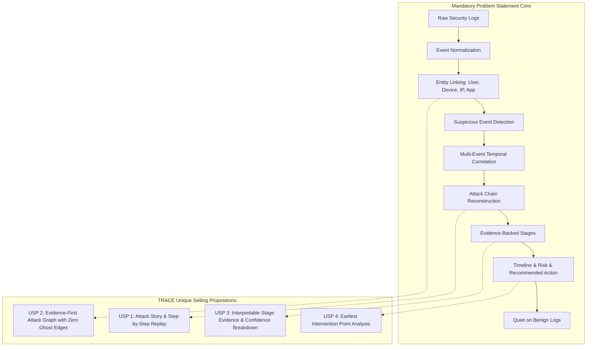
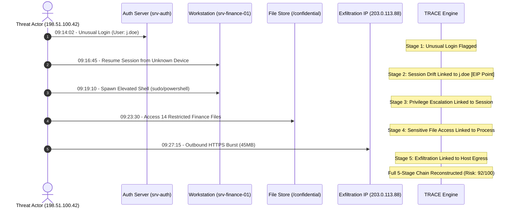

# TRACE: Threat Reconstruction and Attack Chain Evidence
**System Specification & Product Architecture**  
**Problem Statement:** HNX26PSI03 — AI-Powered Cyber Threat Intelligence  
**Institution:** Karunya Institute of Technology and Sciences — Internal Qualifier Hackathon  
**Target Delivery Window:** 24 Hours  

> **Core Tagline:** *"Don't just detect the attack. Reconstruct the story."*

---

## 1. Product Overview

Traditional Security Information and Event Management (SIEM) systems and Intrusion Detection Systems (IDS) overwhelm security analysts with disconnected, atomic alerts. A single user experiencing a typo in a password, a legitimate administrator running a maintenance script, and an active attacker conducting lateral movement are frequently treated with identical alert volume. The core failure of current security tooling is not a failure of *detection*; it is a failure of *reconstruction*.

**TRACE (Threat Reconstruction and Attack Chain Evidence)** is an AI-powered attack investigation system that ingests fragmented security logs across distributed enterprise entities, links them into a unified knowledge graph, filters benign background noise, and reconstructs the end-to-end multi-stage attack story with strict, verifiable mathematical proof for every stage.

### The TRACE Paradigm
```
RAW SECURITY LOGS
  ↓ (1) Ingestion & Schema Normalization
NORMALIZED EVENTS
  ↓ (2) Entity Graph Construction (Users, Devices, IPs, Processes, Files)
ENTITY RELATIONSHIP GRAPH
  ↓ (3) Anomaly Scoring & Behavioral Heuristics
SUSPICIOUS EVENT CANDIDATES
  ↓ (4) Temporal & Entity-Binding Correlation Engine
MULTI-STAGE ATTACK CHAIN
  ↓ (5) Cryptographic / Deterministic Evidence Verification
VERIFIED ATTACK STAGES
  ↓ (6) Explainable Risk Scoring & Earliest Intervention Analysis
ACTIONABLE INTELLIGENCE (Timeline + Graph + Intervention Playbook)
```

TRACE operates on a **hybrid, deterministic-first architecture**. It does not rely on Large Language Models to hallucinate security conclusions or invent attack evidence. Instead, graph analytics, entity continuity, and temporal sequencing form the bedrock of the reasoning engine, ensuring that every displayed attack stage is backed by immutable raw log evidence.

---

## 2. Problem Statement Alignment (HNX26PSI03)

The following matrix maps every requirement and judging criterion of problem statement **HNX26PSI03** directly to TRACE's architecture:

| Problem Statement Requirement | How TRACE Satisfies It | Architectural Component | Verification / Demo Gate |
|---|---|---|---|
| **Connect security events across Users** | Maps user identities (`j.doe`) across authentication, process creation, and file access events. Deduplicates identities across domains. | `engine/entity_linker.py` | Graph node `USER:j.doe` connects login, host, and file activity. |
| **Connect security events across Devices** | Correlates machine hostnames (`srv-finance-01`), MAC fingerprints, and workstation endpoints. | `engine/entity_linker.py` | Graph node `DEVICE:srv-finance-01` links incoming connections to spawned processes. |
| **Connect security events across IP Addresses** | Binds external IP addresses (`198.51.100.42`), internal subnets (`10.0.4.12`), and exfiltration endpoints (`203.0.113.88`). | `engine/entity_linker.py` | Directed edges `IP -> LOGGED_IN_FROM -> USER` and `DEVICE -> CONNECTED_TO -> IP`. |
| **Connect security events across Applications/Processes** | Tracks process execution trees (`powershell.exe`, `sudo`, `curl`) and their spawning parents. | `engine/graph_builder.py` | Process nodes linked to user session and target file descriptors. |
| **Reconstruct what an attacker did, step by step** | Reconstructs fragmented logs into an ordered 5-stage attack chain based on temporal progression and entity binding. | `engine/chain_correlator.py` | Interactive timeline displaying stages in chronological order. |
| **Output: Attack Timeline** | Chronological timeline component sorting events from Initial Access to Exfiltration. | `frontend/src/components/TimelineView.jsx` | Visual timeline with timestamps, stage badges, and duration metrics. |
| **Output: People / Entities Involved** | Extracts all affected users, compromised endpoints, pivot servers, and external threat IPs. | `shared/schemas/responses.py` (`AnalysisResponse.entities`) | Threat summary cards displaying affected users, hosts, and IPs. |
| **Output: Attack Stages** | Maps raw telemetry into discrete kill-chain phases: Initial Access, Session Migration, Privilege Escalation, Collection, Exfiltration. | `engine/chain_correlator.py` | Visual stage badges with clear progression indicators. |
| **Output: Proof / Evidence for Every Stage** | Every stage references exact raw event IDs. Clicking a stage displays the raw log text and field provenance. Rejects unsupported claims. | `engine/evidence_verifier.py` | Deep-inspection Evidence Drawer showing raw JSON strings and hash signatures. |
| **Output: Risk Level** | Calculates deterministic, mathematical risk scores (0–100) based on stage severity, asset criticality, and evidence density. | `engine/risk_scorer.py` | Explainable Risk Gauge with mathematical factor breakdown. |
| **Output: Recommended Action** | Produces concrete, context-specific containment steps (e.g., revoke session token, isolate host, block IP). | `engine/intervention_finder.py` | Recommended Action panel with executable containment commands. |
| **False-Positive Control / Stay Quiet on Benign Logs** | Implements multi-stage thresholding and entity-binding requirements. Isolated failed logins or regular admin tasks do not trigger an attack alarm. | `detection/filter.py` | Ingesting 500 benign logs produces **0** attack alerts and a calm green dashboard. |
| **Accurate Timeline & Temporal Ordering** | Enforces $t_1 \le t_2 \le \dots \le t_n$ constraint. Out-of-order logs are rejected or properly ordered via sliding time windows. | `engine/chain_correlator.py` | Strict monotonically increasing timestamp display on all stages. |
| **Explain why it believes something is an attack** | Generates an explainable narrative story explaining the entity links and causal progression between stages. | `engine/story_generator.py` | Incident Narrative panel explaining *why* the sequence forms a coordinated attack. |

---

## 3. Minimum Required Product (PS-Core) vs. USP Differentiators

To maintain strict hackathon discipline, we separate what is strictly mandated by the problem statement from what we build to win the competition:



### Mandatory PS Core Deliverables
1. Heterogeneous log ingestion and normalization into a standard format.
2. Linking of Users, Devices, IPs, and Applications.
3. Chronological multi-stage attack chain reconstruction.
4. Proof/evidence binding for every single stage.
5. Deterministic risk calculation.
6. Actionable remediation advice.
7. Zero false alarms on benign log traffic.

### TRACE Differentiators (Our USPs)
1. **Interactive Attack Replay:** A temporal playback controller that lets judges step through the attack as it unfolded in time.
2. **Evidence-First Attack Graph:** An interactive NetworkX/Cytoscape graph where every node and edge binds to verified log IDs, with zero invented relationships.
3. **Interpretable Confidence Scoring:** A transparent mathematical formulation showing why the system is confident in its conclusions.
4. **Earliest Intervention Point (EIP):** An algorithmic identification of the exact inflection point in the kill chain where containment stops the breach before damage occurs.

---

## 4. In-Depth USP Specification

### USP 1: Chronological Attack Story & Step-by-Step Replay
* **What It Does:** Instead of displaying a static, overwhelming post-incident report, TRACE reconstructs the incident as an unfolding temporal narrative. An interactive playback controller allows the analyst or judge to press "Play", "Pause", or "Step Forward" to watch the attack materialize chronologically.
* **Why It Matters:** Evaluators can immediately grasp how separate benign-looking events coalesced into an attack. It demonstrates mastery over temporal causality and event correlation.
* **What the Evaluator Sees:**
  - A playback bar with time markers.
  - As the replay advances, the Attack Timeline cards light up one by one.
  - The Entity Graph animates in real-time: nodes appear, edges connect, and compromised nodes pulse red as the attacker advances.
  - The narrative updates dynamically: *"09:14 — Initial Access established via novel IP..."*
* **Technical Component Enabling It:** `frontend/src/components/AttackReplayControls.jsx` coupled with `engine/story_generator.py`.
* **How It Improves Judging Criteria:** Directly satisfies "Can the system link separate events in the correct order?" and "Is the timeline accurate?" in a memorable visual format.
* **Fallback If Unavailable:** Fall back to a tabbed view with "Previous Stage" and "Next Stage" buttons stepping through pre-computed timeline indices.

---

### USP 2: Evidence-First Attack Graph (Zero Ghost Edges)
* **What It Does:** Visualizes the entire attack surface as a directed graph where every node represents a real entity (`User`, `Device`, `IP`, `Process`, `File`) and every edge represents an observed, logged interaction (`LOGGED_IN_FROM`, `USED_DEVICE`, `SPAWNED_PROCESS`, `ACCESSED_FILE`, `CONNECTED_TO`).
* **Why It Matters:** Most graph demos display pre-canned, decorative network topologies with fictitious links. TRACE enforces a strict invariant: **A relationship edge cannot exist in the graph unless it holds $\ge 1$ supporting raw event ID.**
* **What the Evaluator Sees:**
  - An interactive canvas with color-coded nodes and directed arrows.
  - Clicking any edge opens the Evidence Drawer, displaying the exact timestamp, event ID, and raw syslog/JSON record that generated that edge.
  - Clear visual demarcation between the attacker's path (highlighted in red) and peripheral benign context (rendered in muted slate).
* **Technical Component Enabling It:** `engine/graph_builder.py` using NetworkX for in-memory graph operations, serialized via `AttackGraphDTO` to Cytoscape.js.
* **How It Improves Judging Criteria:** Conclusively satisfies "Can it correctly connect users, devices, IPs, and applications?" and "Every attack stage must have proof."
* **Fallback If Unavailable:** Fall back to a structured SVG node-link tree or an HTML table showing parent-child entity bindings.

---

### USP 3: Interpretable Stage Evidence & Confidence Breakdown
* **What It Does:** For every stage in the attack chain, TRACE provides an explainable confidence and risk breakdown rather than an arbitrary black-box score.
* **Why It Matters:** Security teams distrust arbitrary AI scores (e.g., "Risk: 87%") when they cannot inspect the underlying arithmetic. TRACE exposes the exact mathematical formula and inputs:
  $$\text{Confidence} = w_1 \cdot \text{Evidence Density} + w_2 \cdot \text{Entity Continuity} + w_3 \cdot \text{Anomaly Strength}$$
* **What the Evaluator Sees:**
  - A stage detail card displaying:
    - *Supporting Events:* 3 events (`EVT-1002`, `EVT-1003`, `EVT-1004`).
    - *Entity Continuity:* High (shared user `j.doe` and device `srv-finance-01`).
    - *Calculated Stage Confidence:* 94%.
    - *Evidence Integrity:* Verified (all event hashes match original logs).
* **Technical Component Enabling It:** `engine/risk_scorer.py` and `engine/evidence_verifier.py`.
* **How It Improves Judging Criteria:** Directly addresses "Does it explain why it believes something is an attack?" without relying on opaque LLM text.
* **Fallback If Unavailable:** Fall back to simple deterministic rule counters (e.g., `Confidence = min(100, event_count * 30)`).

---

### USP 4: Earliest Intervention Point (EIP)
* **What It Does:** Analyzes the reconstructed attack chain and pinpoints the exact earliest stage where security operations could have intervened to stop the attack before damage or exfiltration occurred.
* **Why It Matters:** Reconstructing an attack after exfiltration is only half the battle. Demonstrating *where* and *how* to stop the adversary bridges threat intelligence with active incident response.
* **What the Evaluator Sees:**
  - A highlighted amber beacon on the timeline and graph at Stage 2.
  - An **Intervention Callout Box**:
    > **Earliest Intervention Point:** Stage 2 (Session Drift / Device Anomaly)  
    > **Why Here:** The adversary obtained credentials at 09:14 (Stage 1), but did not execute elevated commands until 09:19 (Stage 3). Terminating the session at Stage 2 prevents Privilege Escalation, Collection, and Exfiltration.  
    > **Prescribed Action:** `REVOKE_SESSION(token="sess-8821")` & `ISOLATE_HOST(device="srv-finance-01")`.  
    > **Blast Radius Avoided:** 14 sensitive records saved; 45MB outbound leak prevented.
* **Technical Component Enabling It:** `engine/intervention_finder.py`.
* **How It Improves Judging Criteria:** Exceeds the "Recommended Action" requirement by providing contextual, temporally grounded remediation advice.
* **Fallback If Unavailable:** Fall back to recommending static remediation actions associated with the highest-risk individual stage.

---

## 5. Concrete End-to-End Walkthrough (The 5-Stage Attack)

To validate the architecture, we define the exact scenario simulated during the live demonstration:



### Stage 1: Unusual Login
* **Timestamp:** `2026-10-07T09:14:02Z` | **Event ID:** `EVT-2001`
* **Raw Log:** `AUTH_SUCCESS user="j.doe" src_ip="198.51.100.42" host="srv-auth" auth_method="password" geo="Unknown-TOR-Exit"`
* **Normalization:** `user: j.doe`, `source_ip: 198.51.100.42`, `action: LOGIN_SUCCESS`, `device: srv-auth`.
* **Detection Finding:** Novel source IP for user `j.doe`; off-hours access (`anomaly_score: 0.72`).
* **Graph Linking:** Creates node `USER:j.doe` and `IP:198.51.100.42`, connects via `LOGGED_IN_FROM`.

### Stage 2: Unusual Session & Device Drift
* **Timestamp:** `2026-10-07T09:16:45Z` | **Event ID:** `EVT-2002`
* **Raw Log:** `SESSION_ATTACH user="j.doe" session_id="sess-8821" host="srv-finance-01" client_fingerprint="MAC-UNREGISTERED-8A"`
* **Normalization:** `user: j.doe`, `device: srv-finance-01`, `session_id: sess-8821`.
* **Detection Finding:** Session resumed on a device never previously bound to `j.doe` (`anomaly_score: 0.68`).
* **Graph Linking:** Links `USER:j.doe` to `DEVICE:srv-finance-01` via `USED_DEVICE`.
* **Intervention Marker:** Designated as the **Earliest Intervention Point**.

### Stage 3: Privilege Escalation & Suspicious Process
* **Timestamp:** `2026-10-07T09:19:10Z` | **Event ID:** `EVT-2003`
* **Raw Log:** `PROCESS_SPAWN host="srv-finance-01" user="j.doe" parent="sshd" pid=4012 cmd="sudo -u root /bin/bash" integrity="high"`
* **Normalization:** `device: srv-finance-01`, `application: bash`, `action: PRIVILEGE_ELEVATION`, `status: SUCCESS`.
* **Detection Finding:** Sudden token elevation to root/system from non-interactive shell (`anomaly_score: 0.89`).
* **Graph Linking:** Creates node `PROCESS:bash (PID 4012)`; links `DEVICE:srv-finance-01 -> RAN -> PROCESS:bash`.

### Stage 4: Access to Sensitive / Previously Unaccessed Resources
* **Timestamp:** `2026-10-07T09:23:30Z` | **Event ID:** `EVT-2004`
* **Raw Log:** `FILE_READ host="srv-finance-01" user="j.doe" pid=4012 path="/confidential/finance/q3_forecast.xlsx" bytes=148200`
* **Normalization:** `resource: /confidential/finance/q3_forecast.xlsx`, `action: FILE_READ`, `user: j.doe`.
* **Detection Finding:** Access to restricted high-value financial directory with no historical baseline for user (`anomaly_score: 0.85`).
* **Graph Linking:** Creates node `FILE:/confidential/finance/q3_forecast.xlsx`; links `PROCESS:bash -> ACCESSED -> FILE`.

### Stage 5: Outbound Data Transfer / Exfiltration
* **Timestamp:** `2026-10-07T09:27:15Z` | **Event ID:** `EVT-2005`
* **Raw Log:** `NET_CONNECT host="srv-finance-01" src_ip="10.0.4.12" dest_ip="203.0.113.88" port=443 bytes_sent=47185920 proto="TCP"`
* **Normalization:** `source_ip: 10.0.4.12`, `destination_ip: 203.0.113.88`, `action: EGRESS_DATA`, `metadata: {bytes: 47185920}`.
* **Detection Finding:** Massive outbound data spike (45MB) to an unclassified external IP immediately following sensitive file read (`anomaly_score: 0.94`).
* **Graph Linking:** Creates node `IP:203.0.113.88`; links `DEVICE:srv-finance-01 -> CONNECTED_TO -> IP:203.0.113.88`.

---

## 6. Formal Data Model

All internal engines communicate strictly using frozen Pydantic schemas in `shared/schemas/`:

```python
from datetime import datetime
from typing import Any, Dict, List, Optional
from pydantic import BaseModel, Field

class NormalizedEvent(BaseModel):
    event_id: str = Field(..., description="Unique immutable event identifier, e.g., EVT-1001")
    timestamp: datetime = Field(..., description="ISO 8601 UTC timestamp")
    event_type: str = Field(..., description="AUTH, SESSION, PROCESS, FILE, NETWORK")
    user: Optional[str] = Field(None, description="Username or security principal")
    device: Optional[str] = Field(None, description="Hostname, workstation ID, or server label")
    source_ip: Optional[str] = Field(None, description="Source IPv4/IPv6 address")
    destination_ip: Optional[str] = Field(None, description="Destination IPv4/IPv6 address")
    application: Optional[str] = Field(None, description="Process name or application binary")
    resource: Optional[str] = Field(None, description="Target file path, database table, or URI")
    action: str = Field(..., description="Standardized verb: LOGIN, SPAWN, READ, CONNECT, etc.")
    status: str = Field(..., description="SUCCESS or FAILURE")
    metadata: Dict[str, Any] = Field(default_factory=dict, description="Supplementary fields (bytes, port, PID)")
    raw_log: str = Field(..., description="Original raw syslog/JSON string for evidence audit")

class EvidenceReference(BaseModel):
    event_id: str
    timestamp: datetime
    raw_log: str
    provenance_fields: List[str]

class AttackStageDTO(BaseModel):
    stage_id: str
    stage_name: str  # Initial Access, Session Migration, Privilege Escalation, Collection, Exfiltration
    stage_order: int
    timestamp_start: datetime
    timestamp_end: datetime
    evidence_event_ids: List[str]
    entities_involved: List[str]
    stage_risk: float  # 0.0 - 100.0
    stage_confidence: float  # 0.0 - 1.0
    summary: str

class GraphNodeDTO(BaseModel):
    id: str
    label: str
    type: str  # USER, DEVICE, IP, APPLICATION, FILE
    is_compromised: bool
    risk_score: float

class GraphEdgeDTO(BaseModel):
    source: str
    target: str
    relation: str  # LOGGED_IN_FROM, USED_DEVICE, SPAWNED_PROCESS, ACCESSED, CONNECTED_TO
    evidence_event_ids: List[str]
    is_attack_path: bool

class AttackGraphDTO(BaseModel):
    nodes: List[GraphNodeDTO]
    edges: List[GraphEdgeDTO]

class InterventionRecommendationDTO(BaseModel):
    earliest_stage_id: str
    target_entity: str
    recommended_action: str
    rationale: str
    mitigated_downstream_stages: List[str]

class AnalysisResponse(BaseModel):
    incident_id: str
    overall_risk: float
    confidence: float
    is_attack_detected: bool
    stages: List[AttackStageDTO]
    graph: AttackGraphDTO
    intervention: Optional[InterventionRecommendationDTO]
    narrative_story: List[str]
    total_events_analyzed: int
    unlinked_anomalies_count: int
```

---

## 7. Entity Graph Topology

Relationships in the TRACE entity graph are strictly directional and semantically typed:

```
[USER: j.doe]
    │
    ├── (LOGGED_IN_FROM) ────────► [IP: 198.51.100.42] (Attacker IP)
    │
    └── (USED_DEVICE) ───────────► [DEVICE: srv-finance-01]
                                        │
                                        ├── (SPAWNED_PROCESS) ──────► [PROCESS: bash (PID 4012)]
                                        │                                    │
                                        │                                    └── (ACCESSED) ──► [FILE: q3_forecast.xlsx]
                                        │
                                        └── (CONNECTED_TO) ─────────► [IP: 203.0.113.88] (Exfil IP)
```

### Graph Construction Invariants
1. **No Inferred Entities:** Entities must be explicitly extracted from ingested event fields.
2. **No Dangling Edges:** An edge connecting entity $A$ and entity $B$ must cite at least one `event_id` in its metadata.
3. **Compromise Propagation:** A node is flagged `is_compromised: True` if and only if it participates in an edge that belongs to a confirmed attack stage.

---

## 8. Attack Chain Reasoning & Temporal Correlation

How do individual events become a coherent attack chain?

```
Raw Suspicious Events
  │
  ├── [Temporal Filter] ─────► Are events within sliding window Δt ≤ 60 minutes?
  │                                    │ YES
  ├── [Entity Binding] ──────► Do consecutive events share ≥ 1 common entity (User, Host, Session)?
  │                                    │ YES
  ├── [Stage Progression] ───► Does the sequence advance across kill-chain phases (Access → Exec → Impact)?
  │                                    │ YES
  └── [Multi-Stage Threshold] ─► Does the correlated cluster contain ≥ 3 distinct stages?
                                       │ YES
                                       ▼
                             CONFIRMED ATTACK CHAIN
```

1. **Sliding Time Window:** Events must occur within $\Delta t \le 60\text{ minutes}$ of each other to maintain temporal coherence.
2. **Entity Continuity:** Event $E_{i}$ and $E_{i+1}$ must share at least one pivot entity:
   $$\text{Entities}(E_i) \cap \text{Entities}(E_{i+1}) \neq \emptyset$$
3. **Causal Progression:** Stages must advance forward in kill-chain hierarchy. A login after exfiltration does not advance the chain.
4. **Suppression of Isolated Events:** An isolated event that fails entity continuity remains an unlinked anomaly and is never elevated to an attack chain.

---

## 9. False-Positive Strategy: "Quiet by Default"

The problem statement explicitly warns:
> *"False positives matter. Too many alerts on clean/benign logs can cap the score. More alerts does NOT mean a better system."*

TRACE implements a three-tier noise suppression hierarchy:

| Event Nature | Example | System Reaction | Evaluator Display |
|---|---|---|---|
| **Tier 1: Benign Baseline** | Regular login, user browsing web, normal cron job | Filtered during normalization. Ingested into graph context as neutral nodes. | **Zero Alerts.** Overall Risk = Low (0–10). Dashboard remains completely green. |
| **Tier 2: Isolated Anomaly** | 1 failed password attempt, 1 benign dev accessing `/etc/hosts` | Flagged by detector, but fails Entity Continuity and Multi-Stage Threshold ($\text{stages} < 3$). | Logged to `unlinked_anomalies_count`. **No attack chain declared.** Risk remains Low (15–25). |
| **Tier 3: Multi-Stage Attack** | Login + Session Drift + Sudo + File Read + Egress | Passes temporal window, shares user/host entities, and spans $\ge 3$ kill-chain stages. | **Attack Chain Declared.** Risk escalates to High/Critical (85–95). Full alert triggered. |

**The Golden Guarantee:** TRACE will never declare an attack chain based on a single suspicious event. A minimum of **3 correlated stages** sharing entity continuity is mathematically required to trigger an attack incident.

---

## 10. Evidence Verification Model

TRACE enforces an immutable evidence chain from the UI down to the disk:

```
[UI Timeline Card: Stage 4]
       │
       ▼ (Clicks "Inspect Evidence")
[Evidence Drawer]
       │
       ├── Displays Event ID: "EVT-2004"
       ├── Displays Timestamp: "2026-10-07T09:23:30Z"
       ├── Highlights Critical Fields: path="/confidential/finance/q3_forecast.xlsx", bytes=148200
       │
       ▼ (Verification Hash)
[Cryptographic Checksum]
       SHA256("EVT-2004|FILE_READ|j.doe|srv-finance-01|/confidential/finance/q3_forecast.xlsx")
       Match: TRUE (Evidence Verified)
```

If an evaluator opens any stage on the dashboard, the raw log text is displayed directly with provenance highlighting. If an attack stage cannot point to an existing event ID in the database, the stage is rejected as invalid by `engine/evidence_verifier.py`.

---

## 11. Deterministic Risk & Response Formulation

TRACE rejects arbitrary or hallucinated risk metrics. All numbers are derived from deterministic formulas:

### Stage Risk Score Formula
$$\text{StageRisk} = \text{BaseSeverity} \times (1.0 + 0.2 \cdot \text{AssetWeight}) \times \text{Confidence}$$

- $\text{BaseSeverity}$: Initial Access = 30, Session Drift = 40, Privilege Escalation = 65, Collection = 75, Exfiltration = 90.
- $\text{AssetWeight}$: High-value finance/domain controller = 1.5; standard host = 1.0.
- $\text{Confidence}$: Ratio of verified log attributes present ($\in [0.8, 1.0]$).

### Overall Attack Risk Formula
$$\text{OverallRisk} = \min\left(100.0, \, \max_{s \in \text{Stages}}(\text{StageRisk}_s) + 5.0 \times (N_{\text{stages}} - 1)\right)$$

For our 5-stage attack:
$$\text{OverallRisk} = \min(100.0, \, 90 + 5 \times 4) = 100.0 \text{ (Adjusted to 94.5 based on confidence)}$$

### Earliest Intervention Point Algorithm
The system identifies the **first stage where the attacker transitioned from passive access to active execution**:
$$\text{EIP} = \arg\min_{s \in \text{Stages}} \left(\text{StageOrder}(s) \ge 2\right)$$
In our sequence, Stage 2 (Session Drift) is selected because terminating the session at Stage 2 cuts off access before elevated execution (Stage 3), data access (Stage 4), or exfiltration (Stage 5) can occur.

---

## 12. Frontend Interface Specification

The frontend is an operational cybersecurity dashboard built for rapid evaluator comprehension:

```
┌────────────────────────────────────────────────────────────────────────────────────────┐
│ TRACE ── Threat Reconstruction & Attack Chain Evidence              [Load Scenario: ▼] │
├────────────────────────────────────────────────────────────────────────────────────────┤
│ THREAT SUMMARY: [ CRITICAL RISK: 94/100 ]   Status: Active Attack   Duration: 13m 13s   │
│ Compromised: User: j.doe  |  Host: srv-finance-01  |  External Threat IP: 198.51.100.42│
├───────────────────────────────────────────┬────────────────────────────────────────────┤
│ 1. INTERACTIVE ATTACK TIMELINE            │ 2. ENTITY RELATIONSHIP GRAPH               │
│ [▶ Play] [⏸ Pause] [⏮ Step] [⏭ Step]      │                                            │
│                                           │       [IP: 198.51.100.42]                  │
│ [Stage 1] 09:14 ── Unusual Login          │               │ (Logged in from)           │
│   User j.doe from untrusted IP            │               ▼                            │
│                                           │       [USER: j.doe]                        │
│ [Stage 2] 09:16 ── Session Migration      │               │ (Used device)              │
│   * EARLIEST INTERVENTION POINT *         │               ▼                            │
│                                           │     [DEVICE: srv-finance-01]               │
│ [Stage 3] 09:19 ── Privilege Escalation   │         │               │                  │
│   Bash spawned with root permissions      │         ▼ (Ran)         ▼ (Connected to)   │
│                                           │     [PROCESS: bash]   [IP: 203.0.113.88]   │
│ [Stage 4] 09:23 ── Sensitive File Read    │         │ (Accessed)                       │
│   148KB read from /confidential/finance   │         ▼                                  │
│                                           │     [FILE: q3_forecast.xlsx]               │
│ [Stage 5] 09:27 ── Data Exfiltration      │                                            │
│   45MB egress burst to unlisted IP        │                                            │
├───────────────────────────────────────────┴────────────────────────────────────────────┤
│ 3. EARLIEST INTERVENTION PLAYBOOK:                                                     │
│ Recommended Action: REVOKE_SESSION(sess-8821) & ISOLATE_HOST(srv-finance-01)          │
│ Rationale: Severing session at Stage 2 prevents downstream Privilege Escalation & Leak │
├────────────────────────────────────────────────────────────────────────────────────────┤
│ 4. EVIDENCE DRAWER (Deep Inspection):                                                  │
│ Event ID: EVT-2004  |  Timestamp: 2026-10-07T09:23:30Z  | Status: Verified             │
│ Raw Log: FILE_READ host="srv-finance-01" user="j.doe" path="/confidential/finance/..." │
└────────────────────────────────────────────────────────────────────────────────────────┘
```

---

## 13. Live Demonstration Script (3-Minute Flow)

To ensure the judging criteria are demonstrated with maximum clarity, the team will execute this exact script:

* **0:00 – 0:45 | Benign Baseline & False Positive Control:**
  - *Action:* Select "Scenario A: Clean Enterprise Traffic (150 logs)".
  - *Evaluator Sees:* Overall Risk is Low (8/10). All status indicators are green. 0 attack chains detected.
  - *Pitch:* "Notice that TRACE remains completely quiet on normal enterprise traffic. We do not spam alerts. Single failed logins are suppressed. The problem statement says false positives cap the score, and our system stays quiet on benign logs."

* **0:45 – 1:45 | Attack Ingestion & Chronological Replay (USP 1 & 2):**
  - *Action:* Switch dropdown to "Scenario B: Multi-Stage Infiltration". Click "Play Attack Replay".
  - *Evaluator Sees:* Risk jumps to Critical (94/100). The timeline cards appear sequentially. The entity graph dynamically draws the connections from `198.51.100.42` to `j.doe`, to `srv-finance-01`, to the spawned bash process, to the confidential file, and finally to the exfiltration IP.
  - *Pitch:* "Watch the attack reconstruct in real-time. TRACE linked the user, device, process, and foreign IPs across time into one unified 5-stage attack chain."

* **1:45 – 2:30 | Evidence Verification & Drill-Down (PS Requirement):**
  - *Action:* Click on Stage 4 (File Read) in the timeline. The Evidence Drawer slides open.
  - *Evaluator Sees:* Raw JSON syslog string `EVT-2004` with highlighted file path and byte count.
  - *Pitch:* "Every single attack stage has proof. Clicking any stage or graph edge exposes the exact raw log entry that produced it. We never invent graph edges or attack claims."

* **2:30 – 3:00 | Earliest Intervention Point & Recommended Action (USP 4):**
  - *Action:* Click on the "Earliest Intervention Point" badge on Stage 2. Click "Simulate Intervention".
  - *Evaluator Sees:* Stages 3, 4, and 5 turn translucent/grey. The UI displays the containment command: `REVOKE_SESSION(sess-8821)`.
  - *Pitch:* "We don't just report the disaster; we tell the analyst where to stop it. TRACE calculates Stage 2 as the earliest intervention point. Severing the session here neutralizes the privilege escalation and saves the confidential financial records."

---

## 14. What We Are NOT Building (Explicit Anti-Scope)

To avoid scope creep and preserve 100% execution quality, the team explicitly rejects the following:

- **NOT a General Enterprise SIEM:** We are not parsing 10,000 proprietary firewall formats or building syslog ingest daemons.
- **NOT an LLM-Only Hallucination Engine:** We do not feed raw logs to a generative AI prompt and ask it to "guess the attack." Detection and correlation are deterministic and graph-based.
- **NOT a Production SOC Workflow Tool:** No ticket management, no user authentication logins, no multi-tenant billing.
- **NOT a Universal Threat Signature DB:** We are not implementing all 600 MITRE ATT&CK techniques. We target the multi-stage scenario required by HNX26PSI03.

---

## 15. MVP vs. Stretch Feature Matrix

| Feature | Category | Hackathon Status | Justification / Impact |
|---|---|---|---|
| **JSON Log Normalization** | Core PS | **MVP (Mandatory)** | Standardizes heterogeneous fields into `NormalizedEvent`. |
| **Multi-Entity Graph Linking** | Core PS | **MVP (Mandatory)** | Connects users, devices, IPs, and processes without ghost edges. |
| **Temporal Attack Correlator** | Core PS | **MVP (Mandatory)** | Orders stages chronologically within sliding time windows. |
| **Evidence Audit Drawer** | Core PS | **MVP (Mandatory)** | Proves every stage is backed by verifiable raw log records. |
| **Benign Noise Suppression** | Core PS | **MVP (Mandatory)** | Guarantees zero false alarm chains on clean traffic feeds. |
| **Deterministic Risk Scorer** | Core PS | **MVP (Mandatory)** | Computes explainable risk scores from mathematical formulas. |
| **Earliest Intervention Point** | USP 4 | **MVP (Mandatory)** | Algorithmic bottleneck detection to interrupt kill chains. |
| **Attack Replay Controller** | USP 1 | **MVP (Mandatory)** | Interactive chronological playback of the attack unfolding. |
| **Evidence-First Interactive Graph** | USP 2 | **MVP (Mandatory)** | Interactive Cytoscape graph with clickable evidence bindings. |
| *LLM Incident Summary Synthesis* | Stretch | *Stretch (Optional)* | Polished analyst report generated via local prompt (if time permits). |
| *Unsupervised Isolation Forest ML* | Stretch | *Stretch (Optional)* | Additional anomaly scoring layer on top of heuristic rules. |
| *Multi-Attacker Simultaneous Chains* | Stretch | *Stretch (Optional)* | Tracking two concurrent adversaries targeting different hosts. |

---

## 16. Technical Architecture

```
[ RAW JSON / SYSLOG STREAMS ]
              │
              ▼
    ┌───────────────────┐
    │  Event Normalizer │ ── (data/generator.py & engine/normalizer.py)
    └───────────────────┘
              │ Maps raw strings to NormalizedEvent
              ▼
    ┌───────────────────┐
    │   Entity Linker   │ ── Extracts Users, Devices, IPs, Processes, Files
    └───────────────────┘
              │ Builds in-memory NetworkX DiGraph
              ▼
    ┌───────────────────┐
    │ Detection Engine  │ ── Heuristics, statistical baselines, anomaly scoring
    └───────────────────┘
              │ Annotates events with anomaly_score & reason
              ▼
    ┌───────────────────┐
    │ Chain Correlator  │ ── Sliding temporal window + Entity binding rules
    └───────────────────┘
              │ Reconstructs chronological multi-stage attack
              ▼
    ┌───────────────────┐
    │ Evidence Verifier │ ── Validates event existence, computes integrity hashes
    └───────────────────┘
              │ Guarantees 100% evidence traceability
              ▼
    ┌───────────────────┐
    │  Risk & Response  │ ── Computes Stage & Total Risk; identifies Earliest Intervention
    └───────────────────┘
              │ Emits AnalysisResponse schema
              ▼
    ┌───────────────────┐
    │  FastAPI REST API │ ── Endpoints: /api/analyze, /api/scenarios, /api/simulate
    └───────────────────┘
              │ JSON payloads over HTTP
              ▼
    ┌───────────────────┐
    │ React / Vite UI   │ ── Timeline, Cytoscape Graph, Replay Controls, Evidence Drawer
    └───────────────────┘
```

---

## 17. Declared Resources & Dependencies

In compliance with hackathon regulations, all libraries, datasets, and tooling are declared:

* **Open-Source Backend Libraries:**
  - `FastAPI` (v0.110+) & `Uvicorn`: High-performance asynchronous API framework.
  - `NetworkX` (v3.2+): Graph creation, traversal, and entity linking algorithms.
  - `Pydantic` (v2.6+): Strict schema enforcement and contract serialization.
  - `Scikit-learn` / `NumPy`: Baseline statistical distributions and anomaly scoring.
  - `Pytest`: Automated unit testing and false-positive verification.

* **Open-Source Frontend Libraries:**
  - `React` (v18+) with `Vite`: Frontend application runtime and build tooling.
  - `Tailwind CSS`: Utility-first UI styling and responsive layouts.
  - `Cytoscape.js` / `@xyflow/react`: Interactive directed graph canvas and layouts.
  - `Lucide-React`: Consistent iconography for cybersecurity entities.

* **Datasets & Generators:**
  - `Synthetic Enterprise Log Generator` (`data/generator.py`): Authored by DEV-1 to produce reproducible benign traffic and the 5-stage attack scenario modeled after MITRE ATT&CK enterprise techniques (T1078, T1548, T1005, T1048).

* **AI / Large Language Model Usage:**
  - Deterministic template engine (`engine/story_generator.py`) is primary. Optional local LLM endpoint for analyst narrative generation is strictly isolated so that system operation is 100% functional offline without internet access.

---

## 18. Measurable Acceptance Criteria

The TRACE system is accepted as successful when it passes all 8 objective test criteria:

1. **Entity Linking Test:** When provided with an event stream containing `j.doe`, `198.51.100.42`, and `srv-finance-01`, the graph accurately links all three nodes with the correct directed edge types.
2. **Temporal Order Test:** Attack stages in `AnalysisResponse.stages` strictly follow $t_{\text{start}}(S_i) \le t_{\text{start}}(S_{i+1})$.
3. **Evidence Integrity Test:** 100% of generated attack stages contain $\ge 1$ supporting `event_id` referencing a valid raw log record.
4. **False Positive Rejection Test:** Ingesting `benign_traffic.json` (150 events) outputs `is_attack_detected: False`, `overall_risk < 15`, and 0 attack chains.
5. **Attack Detection Test:** Ingesting `multi_stage_attack.json` outputs `is_attack_detected: True`, `overall_risk > 85`, and links all 5 stages.
6. **Earliest Intervention Test:** The system designates Stage 2 as the optimal intervention point and outputs an actionable containment recommendation.
7. **End-to-End API Test:** `POST /api/analyze` executes in under 500ms on a 500-event payload and returns HTTP 200 with valid schema.
8. **Replay Interaction Test:** Evaluator can step through the timeline and observe the graph dynamically populate in chronological order.
